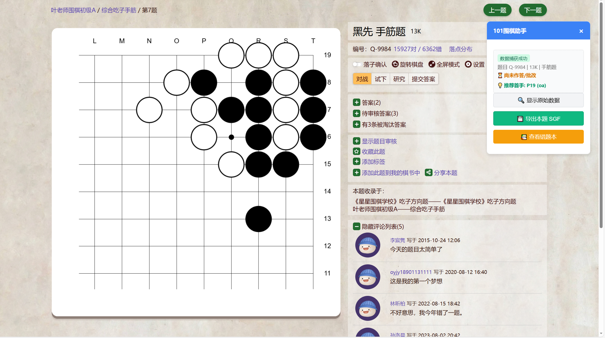
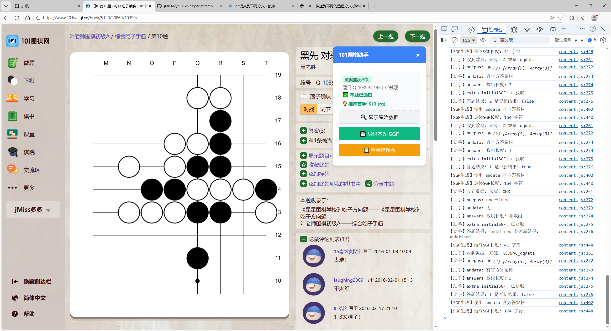
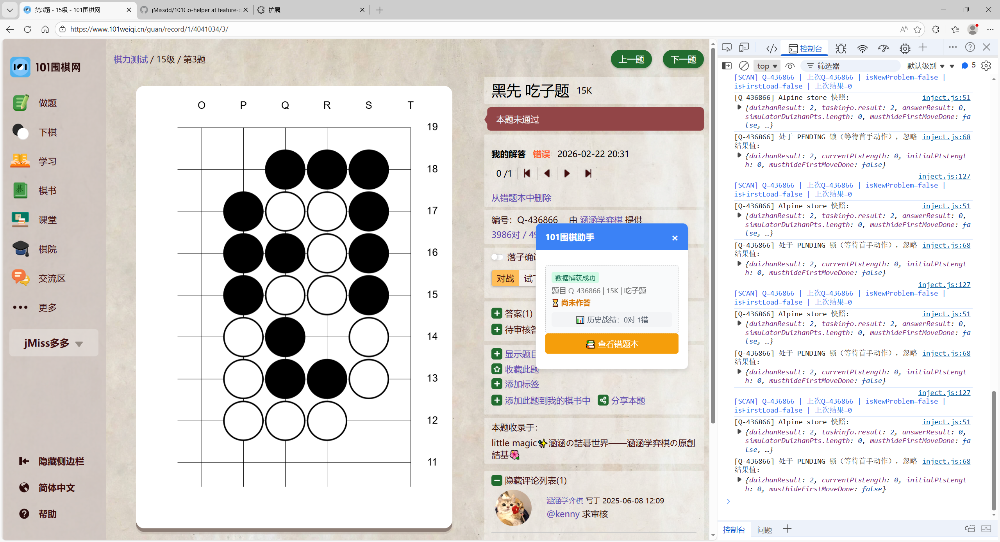

问题1： 是靠瞬时捕获来判断正误的，现在问题是我点下一题之后根本不会刷新，如图所示，题目编号还停留在上一道题，这就是问题所在
v2.0 第一个问题已解决,目前需要搞清楚切题逻辑，为什么切题的时候无法更新答对or答错状态历史，还停留在上一个对错情况的行为？
问题记录如下：
 目前显示正常，切题后显示：，对错状态仍然会停留在上一个题目，但是如果做对or做错会改变这一状态。
目前该问题已经解决，应该去开发做题模式or浏览模式了。
要求2：你采取的逻辑应该是记录这个编号，只要这个编号做对或者做错了永不改变，但实际上如果切完题或者刷新后不应该显示我已做对。现在最好需要增加一个解题历史，我在不切题的情况下肯定是按照逻辑锁存这个结果，当我切题或者刷新之后应该状态变为未作答，但是显示历史答题记录（该题几对几错）
要求3：现在答题状态已经大致修好，不过需要加一个做题模式的限制： 做题模式刷新时也不应该改变对错状态。由于有通过和未通过的块，所以按照这个块的结果来。而且如果超时就会有失败块显示，这里也要根据块判断我做错了。
所有要求已完成，可以开发新的功能
